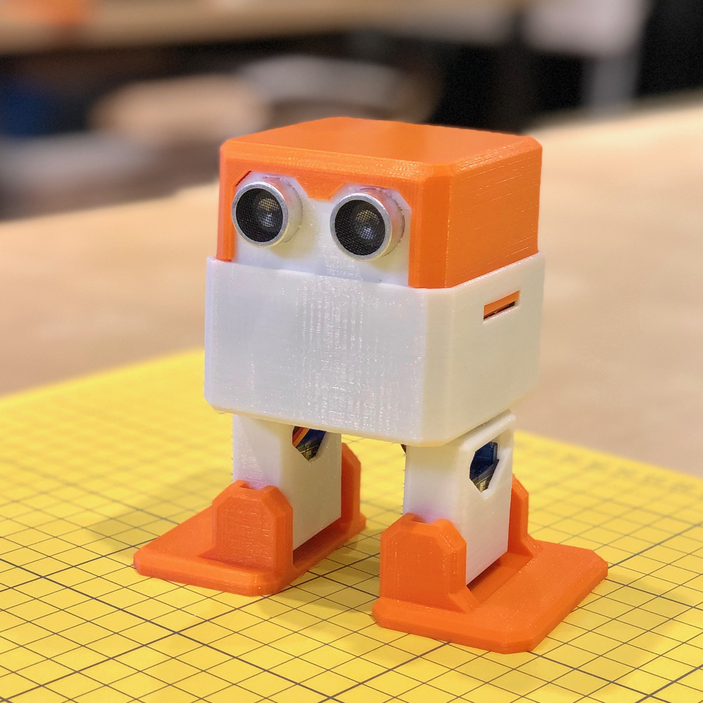

# wombatics-otto
Remix of Otto DIY Robot with Wombatics sam01 Arduino Nano mainboard.

The purpose of this remix, "Wombatics Otto" is to make an Otto DIY Robot with built-in BLE, Motion Sensing and Lithium Battery Charger. The body and head have been changed for easier access to the mainboard and no more hanging wiring.

